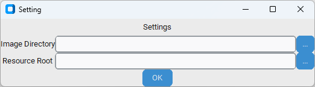

# Support tool
objective: 画像認識コマンドの生成簡易化

environment
python 3.10.11\
環境構築時は`pip install -r requirements.txt`してください

## メイン画面

### 上画面(画像表示エリア)
- 画像表示領域
- drag-dropした画像を表示可能
- マウス左クリックのドラッグドロップで矩形を描ける
- 描いた矩形はマウス右クリックで削除される
- 矩形の範囲内のみで画像認識を行う
    - 矩形は緑枠

### Threshold
- 画像認識のしきい値(一致率)を表示する
- しきい値以上の一致率を示す箇所は上画面で赤枠で囲われる
- 0.01単位で調整可能

### Count
- 検知数

### Accuracy
- 検知したうち、一致率最大箇所の一致率

### Coodinate
- 一致率最大箇所の座標を表示する
    - 矩形描画時は矩形基準で表示する  

### Setting
- 設定画面を開く

### Get Latest Image
- 設定した`Image Directory`フォルダ内にある最新のpngファイルを上画面に表示する

### Save Select Area
- 矩形選択範囲を切り取って名前をつけて保存する
- 

### Combo box (PokeCon.cfg)
- `./cfg`フォルダ内の書式に従って画面最下段にコマンドを生成する

### Color Setting
- Color
    - カラーで画像認識を行う
- Gray Scale
    - グレースケールで画像認識を行う
- Binarization
    - 2値化して画像認識を行う
    - Auto
        - Otsu Methodにより2値化の閾値を自動設定する
    - Spin box, Slider
        - 手動で閾値を設定する

### 右下エリア(テンプレート表示エリア)
- 画像認識用のテンプレート画像を表示する領域
- 右下にテンプレート画像のサイズを表示

### Load Template Image
- テンプレート画像を読み込む

## Setting

### Image Directory
画像認識対象の画像を保管しているフォルダを選択\
e.g. Screen Shotフォルダ

### Resource Root
コマンド生成時のテンプレート画像のrootとなるパス\
e.g. SerialControllerフォルダ
